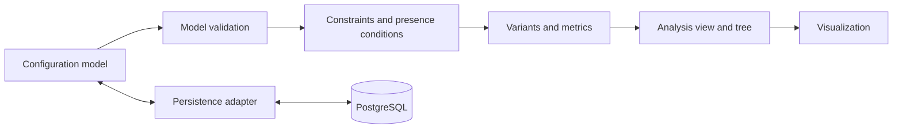

# Architecture Overview

Status: target architecture; the prototype may initially implement a smaller vertical slice.

| Area | Responsibility | Boundary |
|---|---|---|
| Core model | Features, constraints, elements, and configurations | No UI or database logic |
| Expression engine | Validate and evaluate portable rules | No layout or storage decisions |
| Analysis engine | Calculate valid configurations, variants, and metrics | Domain- and UI-independent |
| View builder | Project and group results by dimensions | Does not change domain rules |
| UI | Control views and explain results and errors | Does not redefine semantics |
| Application/API | Coordinate use cases and expose results | Transport remains outside the core |
| Persistence adapter | Save and load domain data | Database details remain replaceable |

The prototype application owns the initial integrated implementation. Stable boundaries may later become reusable framework components.
