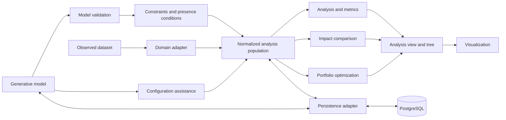

# Architecture Overview

Status: target architecture; the prototype may initially implement a smaller vertical slice.

| Area | Responsibility | Boundary |
|---|---|---|
| Core model | Features, model constraints, elements, usages, configurations, records, dimensions, scenarios, and portfolios | No UI or database logic |
| Domain adapter | Map and document external observations | No invented generative semantics |
| Expression engine | Validate and evaluate portable model rules | Numeric portfolio rules are a separate contract |
| Normalization | Produce versioned variant records and structural signatures | Preserve source and derivation provenance |
| Analysis engine | Calculate records, distinct variants, element metrics, and grouped results | Domain- and UI-independent |
| Impact engine | Compare an explicit scenario with its baseline | Does not mutate or reinterpret the baseline |
| Configuration engine | Complete partial requirements against a generative model | Distinguishes partial requests from complete configurations |
| Optimization engine | Select feasible portfolios and evaluate objectives | Does not redefine model validity or analysis counts |
| View builder | Project and group results by dimensions | Does not change domain rules |
| UI | Control views and explain results and errors | Does not redefine semantics |
| Application/API | Coordinate use cases and expose results | Transport remains outside the core |
| Persistence adapter | Save and load versioned models, mappings, populations, and results | Database details remain replaceable |

The prototype application owns the initial generative-model, normalization, analysis, persistence, and presentation slice. Domain adapters, impact analysis, configuration assistance, and optimization are added in stages. Stable boundaries become reusable framework components only after synthetic fixtures and the food-service reference domain validate them.
