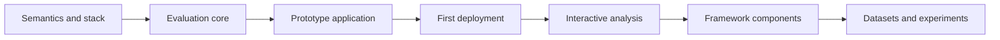

# Development Plan

Status: proposed sequence without confirmed dates.



The prototype application is the first integrated deliverable. Framework components are created later from stable, verified contracts rather than treated as prerequisites.

## Proposed repository evolution

```text
apps/prototype/
  api/                   Independent backend project
    src/                 API and domain source
    tests/               Unit, contract, and persistence tests
  ui/                    Independent frontend project
    src/                 UI source and assets
    tests/               Component, interaction, and accessibility tests
  integration-tests/     Black-box UI/API/PostgreSQL checks
  deployment/            Single-image deployment assembly
docs/                    Product, architecture, decisions, development, operations
examples/                Synthetic models and later domain fixtures
spec/                    Stable interchange and result contracts
compliance-tests/        Shared reference inputs and expected outputs
java/                    Later Java components
python/                  Later Python components
typescript/              Later TypeScript components
ui/angular/              Later Angular visualization components
ui/react/                Later React visualization components
experiments/             Reproducible algorithm and storage studies
```

Create only the directories required by current work. Add implementation evidence and observed limitations as each milestone is completed.
